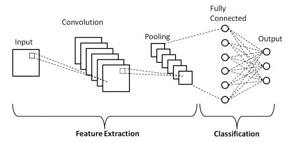
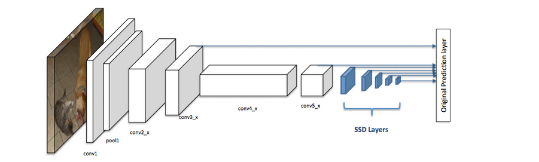
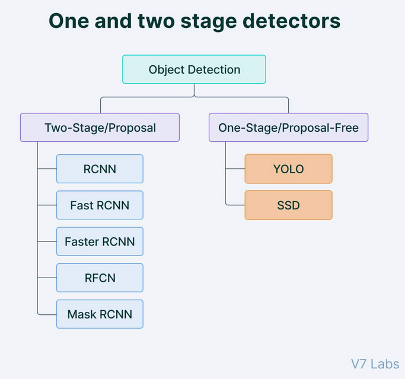
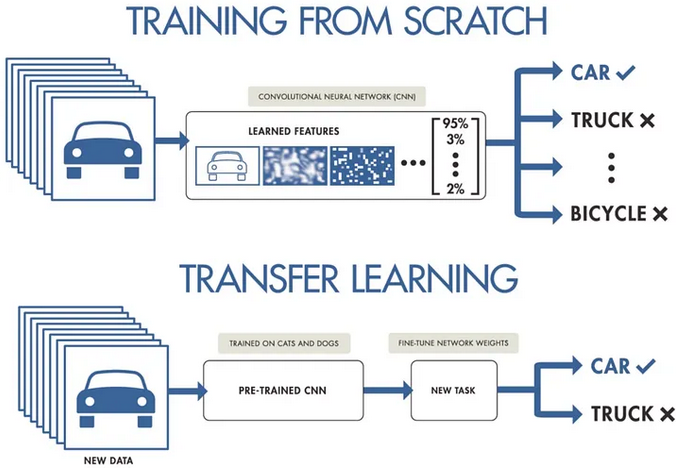
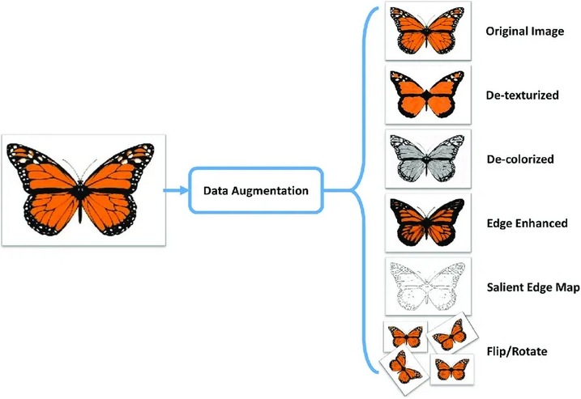

# Detecção de Objetos (Object Detection)
A detecção de objetos é uma tarefa de visão computacional que vai além da simples classificação de imagens, ao identificar e localizar múltiplos objetos dentro de uma imagem. Diferentemente da classificação de imagens, que prevê apenas o rótulo mais provável para a imagem como um todo, a detecção de objetos prevê não apenas o rótulo de cada objeto, mas também sua localização precisa, delimitada por caixas de contorno (bounding boxes).
## Labels e Classificação na Detecção de Objetos

Na detecção de objetos, labels ou rótulos referem-se às categorias ou classes de objetos que o modelo pode identificar em uma imagem. Cada objeto detectado recebe um rótulo que corresponde à sua classe (por exemplo, carro, pessoa, cachorro), e uma bounding box é desenhada ao redor de cada objeto, indicando sua posição exata na imagem.

Além da localização, a detecção de objetos envolve a classificação de cada item detectado, atribuindo a ele um rótulo com uma pontuação de confiança. Isso significa que o modelo não só deve encontrar onde os objetos estão na imagem, mas também determinar a que classe pertencem e o quão confiante está sobre essa predição.

# Classificação de imagens com localização (object localization)

A classificação de imagens com localização é uma tarefa de visão computacional que combina a identificação da classe de objetos em uma imagem com a determinação de sua posição, representada por uma caixa delimitadora. Essa abordagem permite não apenas classificar o objeto, mas também localizar sua área dentro da imagem.

O uso de **Deep Learning** na detecção e localização de objetos em imagens transformou significativamente o campo da visão computacional. Ele introduziu uma série de técnicas e modelos capazes de processar e interpretar dados visuais com um nível de precisão e eficiência que era impossível com métodos tradicionais. Vamos explorar mais detalhadamente como as redes neurais convolucionais (CNNs) e outras abordagens de Deep Learning são aplicadas na **classificação de imagens com localização de objetos**, usando o contexto do que foi discutido anteriormente.

## O Papel do Deep Learning na Classificação e Localização de Objetos

O **Deep Learning** revolucionou a maneira como abordamos a visão computacional devido à sua capacidade de aprender representações complexas diretamente a partir dos dados. O foco em redes neurais convolucionais (CNNs) tornou-se um padrão para tarefas de classificação e localização de objetos devido à sua eficácia em capturar características visuais ricas e discriminativas. 

### Camadas de Redes Neurais Convolucionais (CNNs)

As redes neurais convolucionais (CNNs) são compostas por diferentes tipos de camadas que desempenham papéis essenciais no processamento de imagens para classificação e localização de objetos. Vamos explorar as camadas principais:**camada de entrada**, **camada de convolução**, **camada de pooling** e **camada densa**.

#### 1. Camada de Entrada

A camada de entrada recebe a imagem original e a transforma em um formato que a rede neural possa processar. Normalmente, as imagens são redimensionadas e normalizadas para facilitar o treinamento.

#### 2. Camadas de Convolução (Convolutional Layers)

A camada de convolução é a base das CNNs e é responsável por extrair características importantes das imagens.

- **Filtros (Kernels)**:
  - Um filtro é uma pequena matriz (por exemplo, 3x3 ou 5x5) que é deslizada sobre a imagem de entrada.
  - Cada filtro multiplica os valores dos pixels e gera um **mapa de características (feature map)** que destaca padrões específicos na imagem.

- **Detecção de Características Locais**:
  - As camadas iniciais aprendem características simples como bordas e formas, enquanto camadas mais profundas capturam padrões complexos.

#### 3. Camadas de Pooling (Pooling Layers)

A camada de pooling reduz a dimensionalidade dos mapas de características e melhora a eficiência do modelo.

- **Max Pooling**:
  - Seleciona o valor máximo em uma janela de tamanho fixo (por exemplo, 2x2), preservando as características mais importantes.
  
- **Average Pooling**:
  - Calcula a média dos valores na janela, suavizando as informações.
 
- **Global Pooling**:
  - Reduz o valor de uma janela inteira para apenas um valor. Pode ser utilizado com o **Average** ou **Max**.

#### 4. Camada Densa (Fully Connected Layer)

As camadas densas, ou **fully connected layers**, conectam cada neurônio a todos os neurônios da camada anterior. O trabalho dessas camadas é manter apenas as características mais importantes de uma imagem.

- **Conexões Totais**:
  - Combinam as características extraídas para tomar decisões finais sobre a classificação da imagem.

- **Aprendizado de Padrões Complexos**:
  - Permitem que o modelo entenda relações complexas entre as características.

- **Softmax e ReLU**:
  - A última camada frequentemente usa **softmax** para converter saídas em probabilidades de classes.
  - Camadas intermediárias usam **ReLU** para capturar não linearidades.

## Arquiteturas Avançadas para Classificação com Localização

O uso de **Deep Learning** impulsionou o desenvolvimento de várias arquiteturas avançadas que são amplamente utilizadas para tarefas de detecção e localização de objetos:

- **YOLO (You Only Look Once)**:
  - YOLO é uma das arquiteturas mais rápidas e eficientes para detecção de objetos. Ele utiliza uma abordagem de previsão única, onde toda a imagem é analisada apenas uma vez (daí o nome "You Only Look Once"), dividindo a imagem em uma grade e prevendo simultaneamente as classes e as caixas delimitadoras para cada célula dessa grade. A eficiência de YOLO o torna ideal para aplicações em tempo real, como vigilância por vídeo e carros autônomos.

  

- **SSD (Single Shot Detector)**:
  - O Single Shot Detector (SSD) é uma técnica de detecção de objetos em imagens que combina rapidez e precisão ao realizar a identificação e localização de múltiplos objetos em uma única passagem pela rede neural. Como a proposta de regiões ou a execução de classificadores em várias janelas deslizantes, o SSD executa a detecção em uma única etapa, o que resulta em tempos de inferência significativamente menores. Ele utiliza uma arquitetura de rede convolucional para prever simultaneamente as classes e as caixas delimitadoras (bounding boxes) dos objetos, tornando-o uma solução eficiente para aplicações em tempo real, como vigilância e sistemas autônomos.

  

- **R-CNN (Regions with Convolutional Neural Networks)**:
  - O R-CNN (Regions with Convolutional Neural Networks) é uma técnica de detecção de objetos que combina redes neurais convolucionais (CNNs) com a geração de propostas de regiões. Ele seleciona regiões candidatas usando métodos como o Selective Search e as processa individualmente em uma CNN para extrair características, permitindo a classificação dos objetos e o ajuste das caixas delimitadoras. Embora tenha alcançado resultados impressionantes em precisão, sua abordagem de processamento individual de propostas o torna relativamente lento, levando ao desenvolvimento de versões mais rápidas, como Fast R-CNN e Faster R-CNN.

  

- Comparação entre YOLO, SSD e R-CNN:

  
  

## Avanços em Técnicas de Deep Learning para Localização

Nos últimos anos, várias técnicas e aprimoramentos foram desenvolvidos para melhorar a eficiência dos modelos de Deep Learning para detecção e localização de objetos:

- **Transfer Learning**:
  - O uso de modelos pré-treinados como VGG, ResNet, Inception, e MobileNet tornou-se comum para melhorar a eficiência dos modelos de localização. O Transfer Learning permite que os modelos aproveitem características já aprendidas em grandes conjuntos de dados, acelerando o treinamento e melhorando a precisão mesmo em conjuntos de dados menores.

  

- **Data Augmentation**:
  - Técnicas de data augmentation, como rotação, espelhamento, recorte e ajuste de cores, são usadas para aumentar a diversidade dos dados de treinamento. Isso ajuda a tornar o modelo mais robusto contra variações nas imagens e melhora sua capacidade de generalização.

  

## Aplicações Reais do Deep Learning em Localização de Objetos

As capacidades avançadas de Deep Learning na classificação e localização de objetos são aplicadas em diversas áreas:

- **Saúde**: Em diagnósticos médicos assistidos por computador, os modelos de Deep Learning são usados para identificar e localizar tumores em imagens de ressonância magnética ou tomografias, auxiliando os profissionais da saúde no diagnóstico precoce de doenças.
  
- **Indústria Automotiva**: Veículos autônomos usam algoritmos de Deep Learning para detectar e localizar pedestres, sinais de trânsito, obstáculos e outros veículos na estrada, garantindo a navegação segura.

- **Vigilância e Segurança**: Sistemas de monitoramento de vídeo utilizam modelos de Deep Learning para identificar atividades suspeitas, rastrear indivíduos em áreas de segurança, e até mesmo reconhecer placas de veículos.

## Conclusão

O uso de **Deep Learning** na detecção e localização de objetos em imagens transformou o campo da visão computacional. As redes neurais convolucionais (CNNs) e arquiteturas avançadas, como YOLO, SSD e R-CNN, são agora essenciais para resolver problemas complexos de classificação e localização. As inovações contínuas em algoritmos, técnicas de treinamento e poder computacional estão permitindo que esses modelos se tornem cada vez mais precisos, rápidos e aplicáveis a uma ampla variedade de desafios do mundo real. À medida que essas tecnologias evoluem, elas continuarão a abrir novas possibilidades em áreas como medicina, automação, segurança e muito mais.

## Fontes
- https://ambolt.io/en/how-object-detectors-learn/#:~:text=The%20loss%20function%20of%20object,in%20predicting%20the%20correct%20class)
- https://www.insightlab.ufc.br/aprenda-a-criar-e-treinar-uma-rede-neural-convolucional-cnn/#:~:text=Um%20modelo%20que%20utiliza%20CNN,Pooling%20e%20Camada%20Totalmente%20Conectada.
- https://www.geeksforgeeks.org/introduction-convolution-neural-network/#convolution-neural-network
- https://pt.linkedin.com/pulse/o-poder-das-redes-neurais-convolucionais-um-guia-pr%C3%A1tico-couto-j7omf
- https://medium.com/@abhishekjainindore24/pooling-and-their-types-in-cnn-4a4b8a7a4611
- https://ubiai.tools/what-are-the-difficulties-associated-with-data-augmentation/
- https://aws.amazon.com/what-is/transfer-learning/#:~:text=Transfer%20learning%20(TL)%20is%20a,it%20is%20ready%20for%20production.
- https://medium.com/analytics-vidhya/non-max-suppression-nms-6623e6572536
- https://www.thinkautonomous.ai/blog/anchor-boxes/
- https://towardsdatascience.com/yolo-object-detection-with-opencv-and-python-21e50ac599e9
- https://www.turing.com/kb/ultimate-battle-between-deep-learning-and-machine-learning
- https://blog.roboflow.com/what-is-r-cnn/
- https://www.v7labs.com/blog/yolo-object-detection
- https://medium.datadriveninvestor.com/introducing-transfer-learning-as-your-next-engine-to-drive-future-innovations-5e81a15bb567
- https://www.labellerr.com/blog/what-is-data-augmentation-techniques-examples-benefits/
