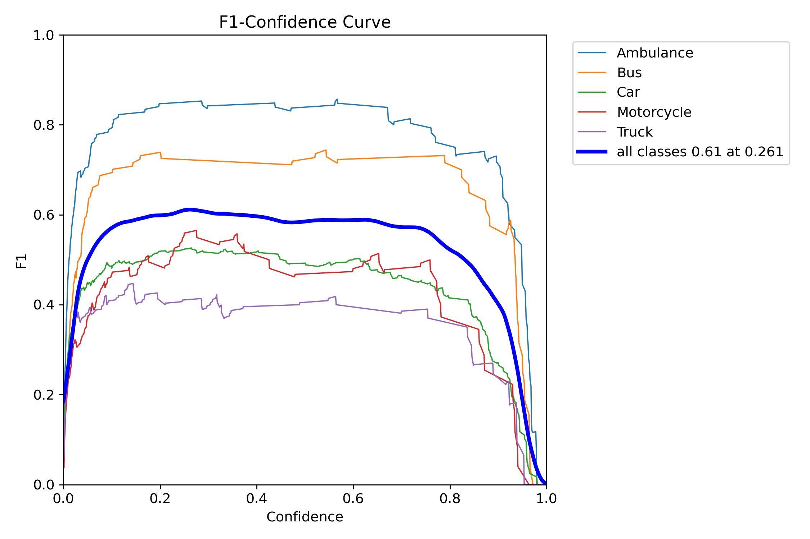
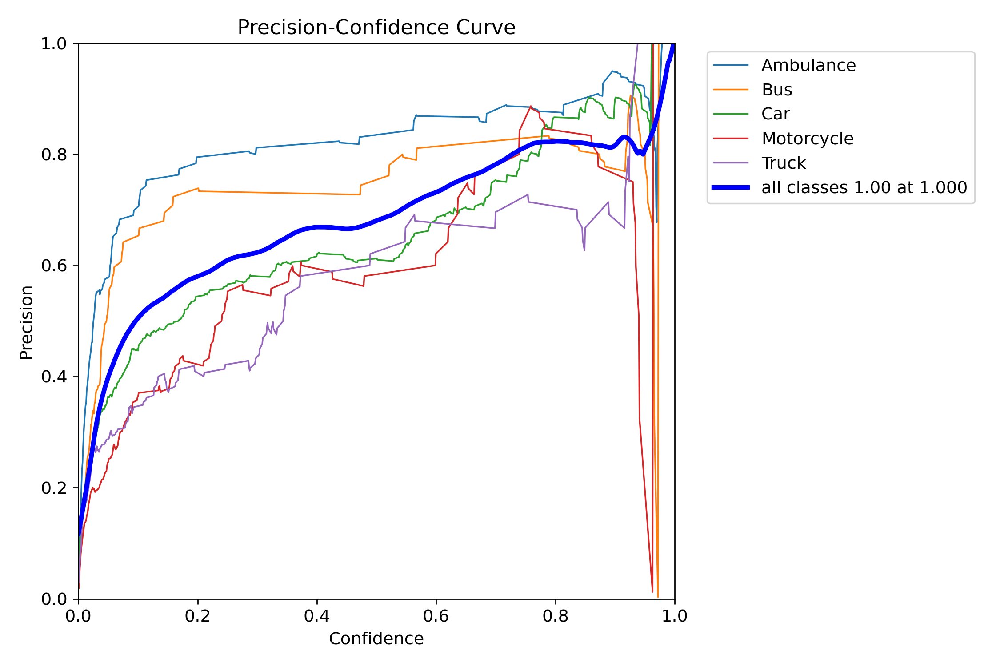
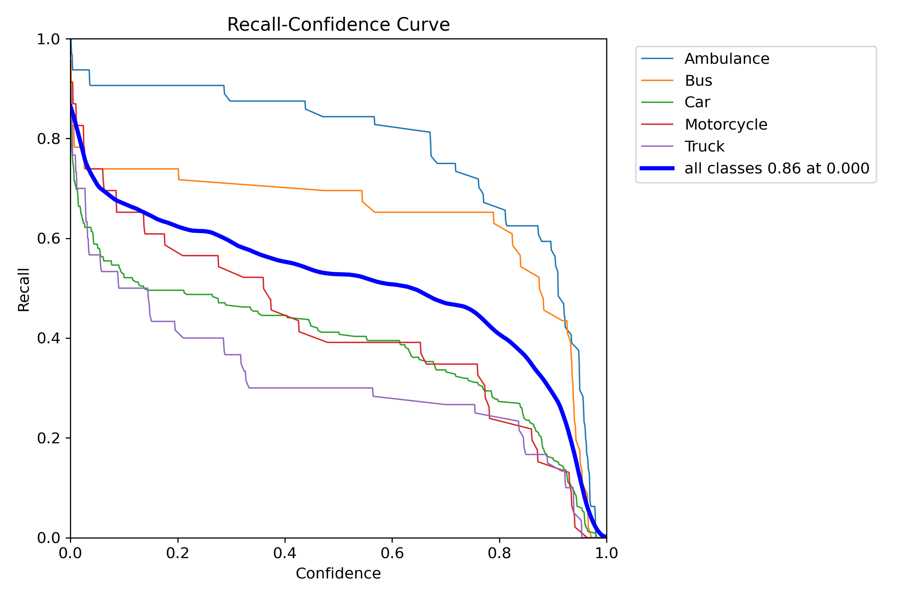
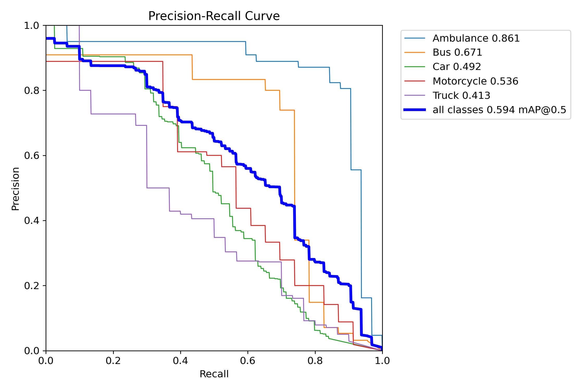
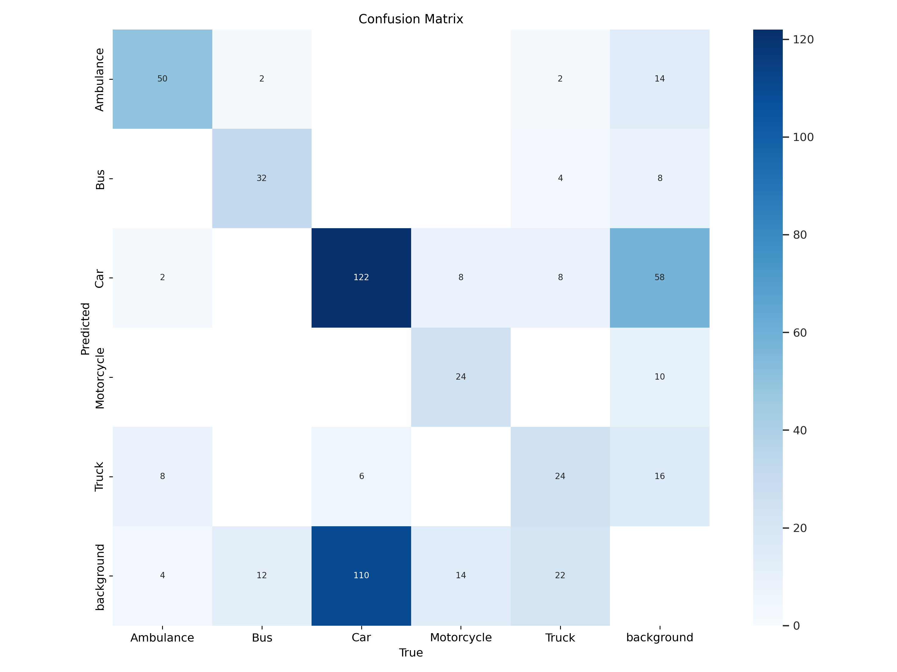
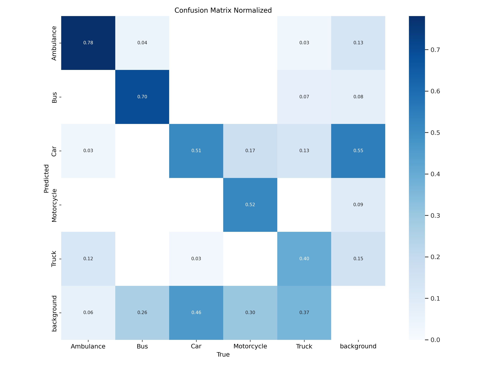
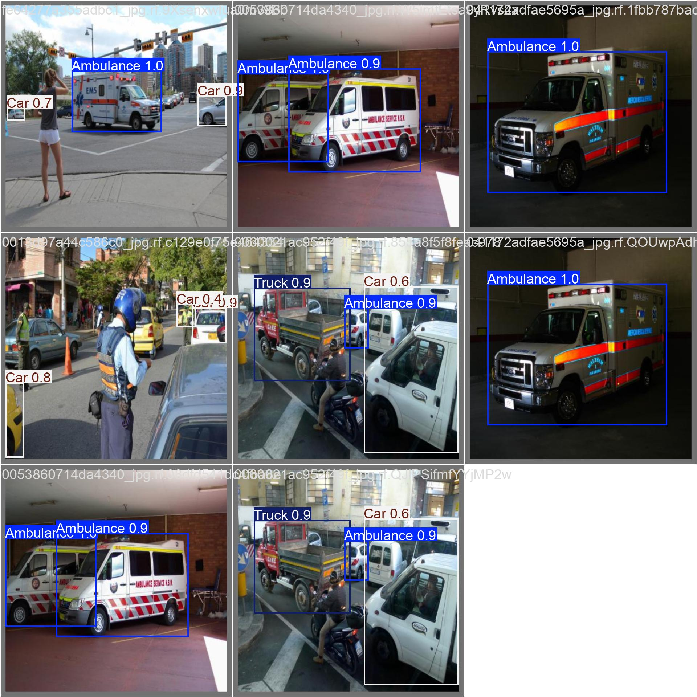

# YOLO Vehicle Detection

Este projeto utiliza a biblioteca YOLO (You Only Look Once) para detectar veículos em imagens e vídeos. O código é implementado em Python e utiliza a biblioteca Ultralytics YOLO para o treinamento e a inferência do modelo.

## Requisitos

- Python 3.x
- Bibliotecas:
  - `ultralytics`
  - `opencv-python`
  - `pandas`
  - `numpy`
  - `matplotlib`
  - `plotly`
  - `kagglehub`

## Instalação

Para instalar as dependências necessárias, execute:

```bash
!pip install ultralytics
```


## Estrutura do Projeto
As variaveis de localização dos arquivos são dadas como as seguintes:

- `train`: Diretório contendo as imagens de treinamento e seus rótulos.
- `validation`: Diretório contendo as imagens de validação e seus rótulos.
- `test`: Diretório contendo as imagens de teste.
- `dataset.yaml`: Arquivo de configuração que define as classes e caminhos para os dados.

## Utilização
O Jupyter Notebook `yolo_vehicle_detection.ipynb` contém o código para treinar o modelo YOLO e realizar a detecção de veículos em imagens e vídeos. A execução do código já está em ordem, basta executar as células sequencialmente.

O dataset utilizado para o treinamento do modelo é o [VehicleDetection-YOLOv8](https://www.kaggle.com/datasets/alkanerturan/vehicledetection) disponível no Kaggle. Por ser um dataset já adaptado para o YOLO, não é necessário realizar a conversão dos rótulos e imagens.

**OBS**: Na função `create_dataset` o tamanho do dataset foi reduzido para 650 imagens de treinamento e 250 imagens de validação pois o ambiente de execução do Google Colab não suportou o treinamento completo do modelo em sua versão gratuita.

## Resultados
Após o treinamento do modelo, é possível visualizar as métricas de desempenho e a detecção de veículos em imagens e vídeos, além do arquivo do próprio modelo treinado. Todos os resultados estão disponíveis no diretório [results](results).

### Gráficos de Métricas





### Matriz de Confusão



### Validação em Imagens
Mais exemplos disponíveis no diretório [validation_batches](results/validation_batches). Lembrando que essas imagens são geradas a partir de um batch de imagens de validação, portanto os resultados podem variar de acordo com o batch utilizado.


### Vídeo de Detecção